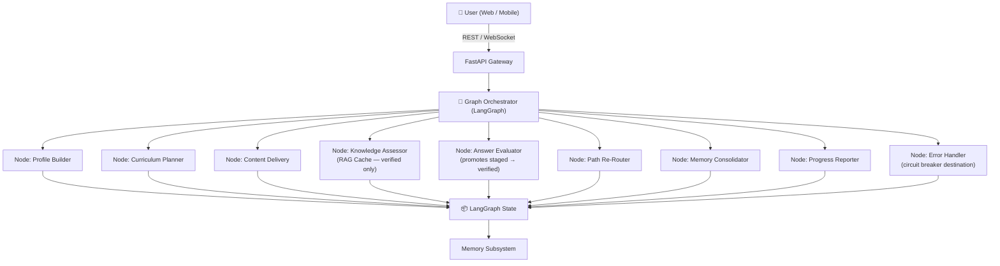
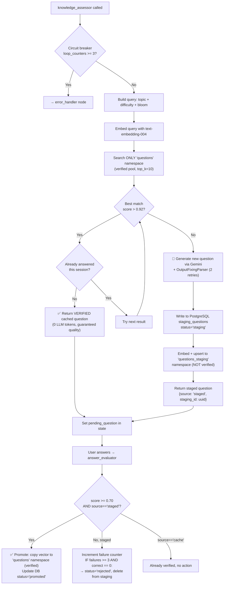
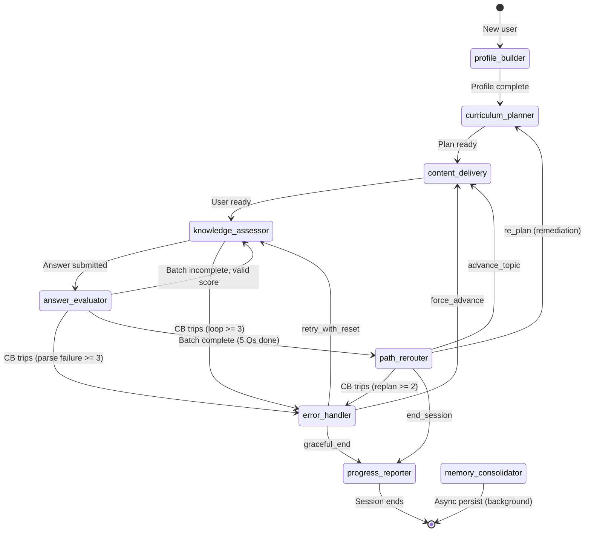

# 🎓 Personalized Learning Agent — System Architecture (v3)

> **Decisions locked**: Generic topics · Gemini API · External content APIs · RAG question cache with quality gate · Circuit-breaker routing · Text-only V1 · Free tier with paid-tier extensibility

---

## 1. High-Level Overview

A **stateful, multi-node LangGraph agent** that builds a dynamic learning path for each user, delivers content pulled live from external APIs, evaluates understanding through adaptive questioning backed by a **RAG question cache**, and continuously re-routes based on performance signals.



---

## 2. Technology Stack

| Layer | Technology | Reason |
|---|---|---|
| **LLM** | Google Gemini 1.5 Pro / Flash | Free tier available, long context window (1M tokens), multimodal-ready for V2 |
| **LLM Framework** | LangChain + LangGraph | Native Gemini support, stateful graph execution |
| **Vector DB** | Pinecone (free tier) | Hosts 3 namespaces: content, questions, semantic memory |
| **Primary DB** | PostgreSQL (Supabase free) | User data, sessions, skill map, checkpoints |
| **Cache / State** | Redis (Upstash free) | LangGraph checkpointer, session cache |
| **Content APIs** | YouTube Data v3, arXiv, Wikipedia, Tavily | Free, rich educational content |
| **Code Execution** | Piston (emkc.org public API) | Sandboxed code eval for programming topics |
| **Backend** | FastAPI + Uvicorn | Async, WebSocket, OpenAPI docs |
| **Frontend** | Next.js 14 (App Router) | Modern, SSR, easy Vercel deploy |
| **Observability** | LangSmith (free tier) | LLM tracing, evals, cost tracking |
| **Auth** | Supabase Auth | Free, integrates with Postgres |

> **Cost for V1**: ~$0/month on free tiers + Gemini API (generous free quota) — ideal for a student project.

---

## 3. Pinecone Namespace Design (3 namespaces in 1 index)

```
pinecone-index: "learning-agent"
│
├── namespace: "content"
│   Stores: chunked content from YouTube transcripts, arXiv abstracts,
│           Wikipedia sections, web pages
│   Key metadata: topic, source_url, content_type, difficulty_level
│   Used by: content_delivery (RAG), curriculum_planner
│
├── namespace: "questions"           ← RAG Question Cache (VERIFIED ONLY)
│   Stores: quality-vetted questions that have been correctly answered
│           by at least one real user, confirming question + answer are sound
│   Key metadata: topic, subtopic, difficulty, bloom_level, question_type,
│                 quality_score, times_used, promoted_at
│   Used by: knowledge_assessor (READ ONLY from this namespace)
│   Logic: search before generate (threshold: cosine sim > 0.92 = reuse)
│
│   ⚠️  WRITE PATH: only answer_evaluator promotes here after quality gate
│   ⚠️  New questions are NEVER written here directly upon generation
│
├── namespace: "questions_staging"   ← Unverified / Newly Generated
│   Stores: freshly generated questions NOT yet confirmed correct by a user
│   Lifecycle: staging → promoted to "questions" OR deleted after 72h if
│             never correctly answered (TTL enforced by nightly Celery job)
│   Source: knowledge_assessor writes here on every cache miss + generation
│
└── namespace: "user_memory_{user_id}"
    Stores: per-user semantic memory (what they've learned)
    Key metadata: topic, learned_at, confidence_at_time
    Used by: curriculum_planner, content_delivery (avoid re-teaching)
```

---

## 4. LangGraph State Schema

```python
from typing import TypedDict, Literal, Any, List, Dict, Annotated
from operator import add

# ── Swarm worker output model ────────────────────────────────────────────────
class SwarmWorkerResult(TypedDict):
    source_type: str          # 'academic' | 'web' | 'video'
    raw_text: str             # extracted body text / transcript
    source_url: str
    title: str
    metadata: Dict[str, Any]  # e.g. arxiv_id, video_id, word_count

# ── Main session state ───────────────────────────────────────────────────────
class LearnerState(TypedDict):
    # --- Identity ---
    user_id: str
    session_id: str

    # --- Profile ---
    user_profile: dict          # goal, background, learning_style, time_budget
    skill_map: dict             # topic → {level, confidence, last_tested}

    # --- Curriculum ---
    master_curriculum: list     # list of LearningUnit dicts
    current_unit_index: int
    current_topic: str
    current_subtopic: str

    # --- Dialogue ---
    conversation_history: list  # list of {role, content} dicts
    last_user_message: str

    # --- Assessment ---
    pending_question: dict | None        # current question being asked
    answered_questions: list             # history for this session
    current_batch_scores: list[float]    # scores in current N-question batch
    consecutive_streak: int              # correct streak for difficulty adjustment

    # --- Routing ---
    next_action: Literal[
        "deliver_content", "ask_question", "evaluate_answer",
        "re_plan", "advance_topic", "end_session", "handle_error"
    ]
    remediation_needed: bool
    session_complete: bool

    # --- Circuit Breakers ---
    loop_counters: dict[str, int]   # node_name → consecutive visit count
    error_context: dict | None      # {"node": str, "reason": str, "last_input": str}

    # --- Content Swarm (parallel fan-out / fan-in) ---
    # swarm_queries: generated by QueryDecomposer, consumed by worker nodes
    swarm_queries: List[Dict[str, str]]  # [{"engine": "academic|web|video", "query": "..."}]

    # CRITICAL: Annotated with `add` reducer so that all three parallel worker
    # nodes can APPEND their results concurrently without overwriting each other.
    # LangGraph merges the lists automatically at the fan-in join point.
    swarm_raw_results: Annotated[List[SwarmWorkerResult], add]

    # Final synthesized markdown lesson, written by ContentSynthesizer
    compiled_markdown_lesson: str

    # --- Meta ---
    total_sessions: int
    flags: dict[str, Any]        # feature flags, extensibility hook
```

---

## 5. Node-by-Node Breakdown

### Node 1 — `profile_builder`
**Trigger**: First message of a new user OR explicit "update profile" intent.

**Flow**:
1. Multi-turn conversation to extract: **goal** ("I want to learn machine learning"), **background** ("I know Python basics"), **daily time** ("30 mins"), **learning style** ("hands-on").
2. Run a **5-question diagnostic** via `knowledge_assessor` in calibration mode to score starting level.
3. Embed the user's goal → store in `user_memory` namespace to guide content personalization.

**Gemini Usage**: Structured extraction with function calling → outputs a validated `UserProfile` object.

**Writes to state**: `user_profile`, `skill_map` (initial), `master_curriculum` (seeds planner)

---

### Node 2 — `curriculum_planner`
**Trigger**: After profile built OR when `path_rerouter` signals `re_plan`.

**Flow**:
1. **Semantic search** in `content` namespace: "what content exists for this goal/topic?"
2. **Gemini call**: Given user goal + background + available content topics → generate ordered `LearningUnit[]`.
3. Each unit: `{topic, subtopics[], estimated_minutes, prerequisites[], resources[]}`.
4. On re-plan: insert remediation units before the current failing unit.

**Generic topic handling**: No hardcoded domain. The knowledge graph is **implicit** — Gemini reasons about prerequisite relationships from its training knowledge (e.g., "linear algebra before neural nets").

**Writes to state**: `master_curriculum`, `current_unit_index`

---

### Node 3 — `content_delivery` → **Parallel Content Swarm Sub-Graph**
**Trigger**: `next_action == "deliver_content"`

This node is implemented as a **compiled LangGraph sub-graph** (`ContentSwarmGraph`) that fans out across three parallel async worker agents and synthesizes their outputs. The parent graph treats the entire sub-graph as a single node.

```
         [Parent Graph: content_delivery node]
                          │
                          ▼
             ┌────────────────────────┐
             │  Node 3.1             │
             │  QueryDecomposer      │  gemini-1.5-flash
             └────────────────────────┘
                          │
         ┌────────────────┼────────────────┐
         ▼                ▼                ▼
┌──────────────┐  ┌──────────────┐  ┌──────────────┐
│ Node 3.2a   │  │ Node 3.2b   │  │ Node 3.2c   │
│ Academic    │  │ Practical   │  │ Multimedia  │
│ Worker      │  │ Worker      │  │ Worker      │
│(arXiv+Wiki) │  │(DuckDuckGo) │  │(YT Transcript)│
└──────────────┘  └──────────────┘  └──────────────┘
         │                │                │
         └────────────────┼────────────────┘
              [add reducer: swarm_raw_results]
                          ▼
             ┌────────────────────────┐
             │  Node 3.3             │
             │  ContentSynthesizer   │  gemini-1.5-pro
             └────────────────────────┘
                          │
                          ▼
             ┌────────────────────────┐
             │  Node 3.4             │
             │  VectorIngestionGate  │  no LLM
             └────────────────────────┘
```

---

#### Sub-Node 3.1 — `QueryDecomposer`
**Model**: `gemini-1.5-flash` with structured output (Pydantic schema).

**Behavior**: Takes `current_topic` + `current_subtopic` → generates exactly three targeted search queries, each aimed at a different pedagogical dimension:

```python
class SwarmQuerySet(BaseModel):
    academic: str   # e.g. "gradient descent convergence proof mathematical"
    practical: str  # e.g. "gradient descent Python implementation learning rate tuning"
    visual: str     # e.g. "gradient descent intuition ball rolling hill analogy"
```

**Writes to state**: `swarm_queries` (list of 3 `{engine, query}` dicts)

---

#### Sub-Nodes 3.2a / 3.2b / 3.2c — Parallel Worker Swarm
All three nodes execute **concurrently** via LangGraph's parallel fan-out. Each is a fully `async` function. Each returns `{"swarm_raw_results": [...]}` and the `add` reducer appends them without collision.

**Node 3.2a — `AcademicWorker`**:
```python
async def academic_worker_node(state: LearnerState) -> dict:
    query = next(q["query"] for q in state["swarm_queries"] if q["engine"] == "academic")
    results = []
    try:
        # arXiv: async via asyncio.to_thread (synchronous client)
        arxiv_results = await asyncio.to_thread(
            arxiv.Search(query=query, max_results=3).results
        )
        for r in arxiv_results:
            results.append(SwarmWorkerResult(
                source_type="academic", raw_text=r.summary,
                source_url=r.entry_id, title=r.title, metadata={"arxiv_id": r.entry_id}
            ))
        # Wikipedia: async via asyncio.to_thread
        wiki_page = await asyncio.to_thread(wikipedia.page, query, auto_suggest=True)
        results.append(SwarmWorkerResult(
            source_type="academic", raw_text=wiki_page.summary,
            source_url=wiki_page.url, title=wiki_page.title, metadata={}
        ))
    except Exception:
        pass  # Fail gracefully — return empty list, never crash graph
    return {"swarm_raw_results": results}
```

**Node 3.2b — `PracticalWorker`**:
```python
async def practical_worker_node(state: LearnerState) -> dict:
    query = next(q["query"] for q in state["swarm_queries"] if q["engine"] == "web")
    results = []
    try:
        # DuckDuckGo: no API key required
        ddg = DuckDuckGoSearchAPIWrapper(max_results=5)
        snippets = await asyncio.to_thread(ddg.results, query, max_results=5)
        for s in snippets:
            results.append(SwarmWorkerResult(
                source_type="web", raw_text=s["snippet"],
                source_url=s["link"], title=s["title"], metadata={}
            ))
    except Exception:
        pass
    return {"swarm_raw_results": results}
```

**Node 3.2c — `MultimediaWorker`**:
```python
async def multimedia_worker_node(state: LearnerState) -> dict:
    query = next(q["query"] for q in state["swarm_queries"] if q["engine"] == "video")
    results = []
    try:
        # Search YouTube for top video IDs (uses google-api-python-client)
        yt_service = build("youtube", "v3", developerKey=YOUTUBE_API_KEY)
        search_resp = await asyncio.to_thread(
            yt_service.search().list(q=query, part="snippet",
                maxResults=3, type="video").execute
        )
        for item in search_resp["items"]:
            video_id = item["id"]["videoId"]
            title = item["snippet"]["title"]
            try:
                # Pull raw transcript (no key needed, uses youtube-transcript-api)
                transcript_chunks = await asyncio.to_thread(
                    YouTubeTranscriptApi.get_transcript, video_id
                )
                transcript_text = " ".join(c["text"] for c in transcript_chunks)
                results.append(SwarmWorkerResult(
                    source_type="video",
                    raw_text=transcript_text[:4000],  # cap at 4k chars
                    source_url=f"https://youtube.com/watch?v={video_id}",
                    title=title, metadata={"video_id": video_id}
                ))
            except Exception:
                pass  # Missing transcript — skip, don't crash
    except Exception:
        pass
    return {"swarm_raw_results": results}
```

**Error isolation guarantee**: Every worker has a top-level `try/except` that returns `[]` instead of raising. One broken API can never terminate the graph or block the synthesizer.

---

#### Sub-Node 3.3 — `ContentSynthesizer`
**Model**: `gemini-1.5-pro` (long context window — all raw results fit in one call).

**Behavior**: Receives the fully merged `swarm_raw_results` list (populated by all three workers via the `add` reducer). Runs a multi-pass compilation:

1. **Deduplication pass** — removes repeated introductory boilerplate across sources.
2. **Notation normalization** — standardizes math symbols, variable names, parameter labels.
3. **Level adaptation** — rewrites complexity to match `user_profile["background"]`:
   - Beginner → replace calculus notation with intuitive analogies
   - Intermediate → retain notation, add worked examples
   - Advanced → preserve full derivations, add edge cases
4. **Structure enforcement** — outputs strict Markdown with sections:
   - `## 🧠 Theoretical Overview`
   - `## 💻 Code Walkthrough`
   - `## 🔍 Practical Analogies`
   - `## 📚 Sources` (all URLs from metadata)

**Writes to state**: `compiled_markdown_lesson`

---

#### Sub-Node 3.4 — `VectorIngestionGate`
**No LLM** — fully programmatic.

**Behavior**:
1. Chunk `compiled_markdown_lesson` → 512 token chunks, 64 token overlap.
2. Embed each chunk via `text-embedding-004`.
3. Upsert to Pinecone `content` namespace, metadata includes all source URLs from `swarm_raw_results`.
4. **Reset swarm state fields** to empty (prevents stale data bleeding into next topic):
   ```python
   return {"swarm_queries": [], "swarm_raw_results": [],
           "compiled_markdown_lesson": ""}
   ```

**Writes to state**: clears swarm fields; Pinecone receives the cached lesson.

---

**After sub-graph exits**: Parent graph reads `compiled_markdown_lesson` from state, appends it to `conversation_history`, and transitions `next_action = "ask_question"`.

**Writes to state** (parent): `conversation_history`, `next_action = "ask_question"`

---

### Node 4 — `knowledge_assessor` ⭐ RAG Question Cache (Read from Verified Only)
**Trigger**: `next_action == "ask_question"` OR user signals readiness.

**Circuit breaker**: If `loop_counters["knowledge_assessor"] >= 3` → write `error_context` and set `next_action = "handle_error"` instead of proceeding.

**Flow**:
```
0. Circuit breaker check:
   IF loop_counters["knowledge_assessor"] >= 3:
       error_context = {"node": "knowledge_assessor",
                        "reason": "stuck_in_assessment_loop",
                        "action": "force_advance"}
       next_action = "handle_error"
       RETURN  ← skip all below

   loop_counters["knowledge_assessor"] += 1

1. Determine difficulty:
   confidence < 0.40  → "easy"   (remember/understand)
   confidence 0.40–0.70 → "medium" (apply/analyze)
   confidence > 0.70  → "hard"   (evaluate/create)

2. Build query vector:
   query = f"{current_topic} | {current_subtopic} | {difficulty} | {bloom_level}"
   query_embedding = gemini.embed(query)

3. Search ONLY "questions" namespace (verified pool):
   results = pinecone.query(
       vector=query_embedding,
       top_k=10,
       filter={"topic": current_topic, "difficulty": difficulty},
       namespace="questions"          ← verified only, never staging
   )

4. Cache hit check:
   IF results[0].score > 0.92 AND question_id NOT IN answered_questions:
       → USE verified cached question (0 LLM tokens, guaranteed quality)
       → Increment times_used metadata in Pinecone
   ELSE:
       → GENERATE new question via Gemini + OutputFixingParser
         (retries up to 2x if JSON schema invalid, then raises)
       → Write to PostgreSQL staging_questions (status='staging')
       → Embed + upsert to "questions_staging" namespace
         (NOT to "questions" — quality gate not yet passed)

5. Question types (Gemini decides based on topic):
   - MCQ (4 options) for conceptual topics
   - Open-ended explanation for analytical topics
   - Code completion for programming topics (→ routed to Piston)
   - Scenario-based for applied topics

6. On success: reset loop_counters["knowledge_assessor"] = 0
```

**Writes to state**: `pending_question` (includes `{..., "source": "cache"|"staged", "staging_id": uuid|None}`)

---

### Node 5 — `answer_evaluator` ⭐ Quality Gate + Cache Promotion
**Trigger**: User submits an answer.

**Circuit breaker**: If `loop_counters["answer_evaluator"] >= 3` (consecutive parse failures) → write `error_context`, force score = 0, skip further retries.

**Flow**:

**Step 1 — Input sanitization** (NEW — prevents gibberish loops):
```python
user_input = state["last_user_message"].strip()

# Gibberish / empty input detection
if len(user_input) < 3 or is_nonsense(user_input):  # regex: all symbols / numbers only
    return {
        "answered_questions": [..., {"score": 0.0,
            "feedback": "Please give a real answer — I can't evaluate that."}],
        "current_batch_scores": [..., 0.0],
        "loop_counters": {**state["loop_counters"],
            "answer_evaluator": state["loop_counters"].get("answer_evaluator", 0) + 1}
    }
# Reset counter on valid input
loop_counters["answer_evaluator"] = 0
```

**Step 2 — Evaluation by question type**:

| Type | Evaluation Method |
|---|---|
| MCQ | Exact match → lookup correct option + distractor explanations (no LLM) |
| Open-ended | Gemini rubric evaluation: correctness + completeness + misconceptions |
| Code | Piston sandbox → test cases pass/fail + Gemini explains failures |
| Scenario | Gemini evaluates against key criteria stored with the question |

> All Gemini calls here use `with_structured_output(EvalResult)` + `OutputFixingParser` with max 2 retries before returning `score=0, feedback="evaluation_failed"`.

**Step 3 — Confidence update** (Exponential Moving Average):
```python
alpha = 0.3
confidence_new = confidence_old * (1 - alpha) + score * alpha
```

**Step 4 — Quality Gate: Promote staged question to verified cache** (NEW — core of cache poisoning fix):
```python
q = state["pending_question"]

if q["source"] == "staged" and score >= 0.70:
    # User answered correctly → question + answer are demonstrably sound
    # Promote from staging to the verified "questions" namespace
    
    staging_row = db.get_staging_question(q["staging_id"])
    staging_row.times_served_correctly += 1

    if staging_row.times_served_correctly >= PROMOTE_THRESHOLD:  # default: 1
        # Upsert to verified Pinecone namespace
        pinecone.upsert(
            vectors=[{"id": q["staging_id"], "values": q["embedding"],
                       "metadata": {...q_metadata, "quality_score": score,
                                    "promoted_at": now()}}],
            namespace="questions"          ← NOW enters verified cache
        )
        db.update_staging_status(q["staging_id"], status="promoted")

elif q["source"] == "staged" and score < 0.70:
    # User struggled — question may be confusing OR answer key may be wrong
    # Do NOT promote. Increment failure counter.
    db.update_staging_question(q["staging_id"],
        times_served_incorrectly=+1,
        # Auto-reject after 3 wrong answers with no correct → likely bad question
    )
    if staging_row.times_served_incorrectly >= 3 and \
       staging_row.times_served_correctly == 0:
        db.update_staging_status(q["staging_id"], status="rejected")
        pinecone.delete(ids=[q["staging_id"]], namespace="questions_staging")
```

**Writes to state**: `answered_questions`, `current_batch_scores`, `consecutive_streak`, `skill_map`, `loop_counters`

---

### Node 6 — `path_rerouter`
**Trigger**: After every N=5 questions in a batch (no LLM — pure logic).

**Decision tree**:
```python
def route_after_batch(state: LearnerState) -> str:
    avg_score = mean(state["current_batch_scores"])
    streak = state["consecutive_streak"]

    if avg_score >= 0.85:
        # Mastered! Move to next topic
        state["current_unit_index"] += 1
        if state["current_unit_index"] >= len(state["master_curriculum"]):
            return "end_session"   # Goal complete
        return "advance_topic"     # → content_delivery next topic

    elif avg_score >= 0.60:
        # Needs more practice, same topic
        return "ask_question"      # 5 more questions, same level

    else:
        # Struggling — insert remediation
        state["remediation_needed"] = True
        return "re_plan"           # → curriculum_planner inserts prereq unit
```

**Writes to state**: `next_action`, `remediation_needed`, `current_unit_index`

---

### Node 7 — `memory_consolidator`
**Trigger**: End of session (async via Celery job, non-blocking).

**Flow**:
1. **Compress** `conversation_history` → Gemini generates a 3-5 sentence session summary.
2. **Persist** to PostgreSQL: session record, all answered_questions, updated skill_map.
3. **Update semantic memory**: for each topic studied, upsert embedding into `user_memory_{user_id}` namespace with current confidence score.
4. **Clear** working state buffer in Redis.
5. **Staging TTL cleanup** (nightly Celery beat job, separate): delete all `staging_questions` rows where `created_at < NOW() - 72h` AND `status = 'staging'`, and delete their Pinecone vectors from `questions_staging` namespace.

**Why async**: This should NOT block the user's next interaction. Fire-and-forget via Celery.

---

### Node 9 — `error_handler` ⭐ Circuit Breaker Destination
**Trigger**: Any routing function detects `loop_counters[X] >= threshold` OR `next_action == "handle_error"`.

**This node NEVER calls an LLM** — it is deterministic and cannot itself loop.

**Flow**:
```python
def error_handler_node(state: LearnerState) -> dict:
    ctx = state["error_context"]
    reason = ctx["reason"]

    if reason == "stuck_in_assessment_loop":
        # Force advance to next topic — don't penalize user for our bug
        next_idx = state["current_unit_index"] + 1
        user_message = (
            "I had trouble generating a good question for this topic. "
            "Let's move ahead — you can always revisit this later!"
        )
        return {
            "current_unit_index": next_idx,
            "loop_counters": {},          # full reset
            "error_context": None,
            "next_action": "deliver_content",
            "conversation_history": [
                *state["conversation_history"],
                {"role": "assistant", "content": user_message}
            ]
        }

    elif reason == "evaluation_parse_failure":
        # Score the question as 0, give user a retry opportunity
        user_message = (
            "Sorry, I couldn't properly evaluate that response. "
            "Could you try rephrasing your answer?"
        )
        return {
            "loop_counters": {**state["loop_counters"], "answer_evaluator": 0},
            "error_context": None,
            "next_action": "ask_question",  # re-show same question
            "conversation_history": [
                *state["conversation_history"],
                {"role": "assistant", "content": user_message}
            ]
        }

    elif reason == "replan_storm":
        # Curriculum planner is stuck re-planning → end session gracefully
        return {
            "session_complete": True,
            "error_context": None,
            "next_action": "end_session"
        }
```

**Writes to state**: Resets `loop_counters`, clears `error_context`, sets safe `next_action`

> 🔑 **Key property**: `error_handler` always routes to a node it has NOT just come from, so it structurally cannot participate in a loop.

---

### Node 8 — `progress_reporter`
**Trigger**: User asks "how am I doing?" / "show my progress" OR end of session.

**Output**:
- Skill map delta: topics mastered this session vs. last
- Streak and consistency data
- Weakest areas + recommended next focus
- Estimated time to goal completion
- Next session preview (what's coming up)

---

## 6. RAG Question Cache — Quality Gate Design



**Verified question metadata** (in `questions` namespace):
```python
{
    "question_text": "...",
    "question_type": "mcq|open|code|scenario",
    "topic": "machine learning",
    "subtopic": "gradient descent",
    "difficulty": "medium",
    "bloom_level": "apply",
    "correct_answer": "...",
    "distractors": [...],           # for MCQ
    "rubric": [...],                # for open-ended
    "test_cases": [...],            # for code
    "generated_at": "2024-...",
    "promoted_at": "2024-...",      # when it passed quality gate
    "quality_score": 0.87,          # score of the validating answer
    "times_used": 3,                # increments on every cache hit
}
```

**Cache growth with quality guarantee**: After ~50 users × 20 questions/session ≈ 1000 *verified* questions. At that point, >80% of assessments are served from cache. Every cached question has been confirmed correct by a real user.

---

## 6b. Circuit Breaker — Design & Thresholds

Every **conditional routing function** (not nodes) checks loop counters before dispatching:

```python
# shared utility used in ALL conditional edge functions
MAX_LOOPS = {
    "knowledge_assessor": 3,   # 3 consecutive entries without valid score progression
    "answer_evaluator":   3,   # 3 consecutive Gemini parse failures / gibberish inputs
    "curriculum_planner": 2,   # 2 consecutive re-plans (re-plan storm prevention)
}

def check_circuit_breaker(state: LearnerState, node: str) -> str | None:
    """
    Returns 'error_handler' if the breaker trips, else None (continue normal routing).
    Call this at the TOP of every conditional edge function.
    """
    count = state["loop_counters"].get(node, 0)
    if count >= MAX_LOOPS.get(node, 999):
        return "error_handler"
    return None
```

**Where each breaker fires**:

| Breaker | Trigger Condition | `error_context.reason` | `error_handler` Action |
|---|---|---|---|
| `knowledge_assessor` | 3 loops with no valid `pending_question` set | `stuck_in_assessment_loop` | Force-advance topic, reset counter |
| `answer_evaluator` | 3 consecutive JSON parse failures OR gibberish inputs | `evaluation_parse_failure` | Re-show question with retry message |
| `curriculum_planner` | 2 consecutive re-plans for same topic | `replan_storm` | End session gracefully |

**Counter lifecycle**:
- **Increment**: at the *start* of each node execution (before LLM call)
- **Reset to 0**: on *successful* state progression (valid question served, valid score written, valid plan generated)
- **Reset all**: when `error_handler` resolves the issue

**LLM Output Safety** (prevents parse failures from hitting the breaker prematurely):
```python
from langchain.output_parsers import OutputFixingParser
from app.Agent.Tools.LlmFactory import get_llm  # ← always use factory, never direct

llm = get_llm("gemini-1.5-flash")  # round-robin key, tenacity backoff built-in

# Wrap every structured output call
base_parser = PydanticOutputParser(pydantic_object=QuestionSchema)
robust_parser = OutputFixingParser.from_llm(parser=base_parser, llm=llm, max_retries=2)
# Only hits the circuit breaker if all 2 internal retries also fail
```

---

## 7. Graph Flow & Edge Logic



---

## 8. LangGraph Implementation

### 8a. Content Swarm Sub-Graph (`ContentSwarmGraph`)

```python
# backend/app/Agent/ContentSwarm/SwarmGraph.py
import asyncio
from typing import Dict, Any
from langgraph.graph import StateGraph, END
from app.Agent.LearnerState import LearnerState, SwarmWorkerResult
from .QueryDecomposer import decompose_queries_node
from .AcademicWorker import academic_worker_node
from .PracticalWorker import practical_worker_node
from .MultimediaWorker import multimedia_worker_node
from .ContentSynthesizer import synthesizer_node
from .VectorIngestionGate import vector_ingestion_node

swarm_workflow = StateGraph(LearnerState)

swarm_workflow.add_node("QueryDecomposer",     decompose_queries_node)
swarm_workflow.add_node("AcademicWorker",      academic_worker_node)
swarm_workflow.add_node("PracticalWorker",     practical_worker_node)
swarm_workflow.add_node("MultimediaWorker",    multimedia_worker_node)
swarm_workflow.add_node("ContentSynthesizer",  synthesizer_node)
swarm_workflow.add_node("VectorIngestionGate", vector_ingestion_node)

swarm_workflow.set_entry_point("QueryDecomposer")

# ── Fan-Out: decomposer → all three workers in parallel ─────────────────────
swarm_workflow.add_edge("QueryDecomposer", "AcademicWorker")
swarm_workflow.add_edge("QueryDecomposer", "PracticalWorker")
swarm_workflow.add_edge("QueryDecomposer", "MultimediaWorker")

# ── Fan-In: all workers → synthesizer (LangGraph waits for all three) ───────
# The `add` reducer on swarm_raw_results merges the three lists automatically.
# LangGraph's synchronization join fires ContentSynthesizer only after
# AcademicWorker, PracticalWorker, AND MultimediaWorker have all returned.
swarm_workflow.add_edge("AcademicWorker",   "ContentSynthesizer")
swarm_workflow.add_edge("PracticalWorker",  "ContentSynthesizer")
swarm_workflow.add_edge("MultimediaWorker", "ContentSynthesizer")

swarm_workflow.add_edge("ContentSynthesizer",  "VectorIngestionGate")
swarm_workflow.add_edge("VectorIngestionGate", END)

# Compile as standalone executor (no checkpointer needed — parent graph owns persistence)
content_swarm_executor = swarm_workflow.compile()
```

### 8b. Parent Graph (`Graph.py`)

```python
# backend/app/Agent/Graph.py
from langgraph.graph import StateGraph, END
from langgraph.checkpoint.redis import AsyncRedisSaver
from langchain_google_genai import ChatGoogleGenerativeAI
from langchain.output_parsers import OutputFixingParser

from .LearnerState import LearnerState
from .CircuitBreaker import check_circuit_breaker, MAX_LOOPS
from .ContentSwarm.SwarmGraph import content_swarm_executor
from .Nodes.ProfileBuilder import profile_builder_node
from .Nodes.CurriculumPlanner import curriculum_planner_node
from .Nodes.KnowledgeAssessor import knowledge_assessor_node
from .Nodes.AnswerEvaluator import answer_evaluator_node
from .Nodes.PathRerouter import path_rerouter_node
from .Nodes.ErrorHandler import error_handler_node
from .Nodes.ProgressReporter import progress_reporter_node

# ── Swarm wrapper: parent graph sees this as a single node ───────────────────
async def content_delivery_node(state: LearnerState) -> dict:
    """Delegates entirely to the compiled swarm sub-graph."""
    # Check user memory first — skip swarm if topic already mastered
    from app.Memory.PineconeClient import user_already_knows
    if await user_already_knows(state["user_id"], state["current_subtopic"]):
        return {
            "compiled_markdown_lesson": "_You've already covered this — let's test your recall._",
            "conversation_history": [
                *state["conversation_history"],
                {"role": "assistant",
                 "content": "_You've already covered this — let's test your recall._"}
            ],
            "next_action": "ask_question"
        }

    # Run the full swarm
    swarm_result = await content_swarm_executor.ainvoke(state)
    lesson = swarm_result["compiled_markdown_lesson"]

    return {
        "compiled_markdown_lesson": lesson,
        "swarm_queries":      [],   # cleared by VectorIngestionGate
        "swarm_raw_results":  [],   # cleared by VectorIngestionGate
        "conversation_history": [
            *state["conversation_history"],
            {"role": "assistant", "content": lesson},
            {"role": "assistant",
             "content": "Take your time. Let me know when you feel ready, "
                        "or ask me anything about this topic."}
        ],
        "next_action": "ask_question"
    }

# ── Parent graph assembly ────────────────────────────────────────────────────
builder = StateGraph(LearnerState)

builder.add_node("profile_builder",     profile_builder_node)
builder.add_node("curriculum_planner",  curriculum_planner_node)
builder.add_node("content_delivery",    content_delivery_node)  # ← wraps swarm
builder.add_node("knowledge_assessor",  knowledge_assessor_node)
builder.add_node("answer_evaluator",    answer_evaluator_node)
builder.add_node("path_rerouter",       path_rerouter_node)
builder.add_node("error_handler",       error_handler_node)
builder.add_node("progress_reporter",   progress_reporter_node)
# memory_consolidator: async Celery task, not a graph node

builder.set_entry_point("profile_builder")

# Static edges
builder.add_edge("profile_builder",    "curriculum_planner")
builder.add_edge("curriculum_planner", "content_delivery")
builder.add_edge("content_delivery",   "knowledge_assessor")
builder.add_edge("progress_reporter",  END)

# ── Conditional: after answer evaluation ────────────────────────────────────
def route_after_eval(state: LearnerState) -> str:
    if breaker := check_circuit_breaker(state, "answer_evaluator"):
        return breaker
    if len(state["current_batch_scores"]) < 5:
        return "knowledge_assessor"
    return "path_rerouter"

builder.add_conditional_edges(
    "answer_evaluator", route_after_eval,
    {"knowledge_assessor": "knowledge_assessor",
     "path_rerouter":      "path_rerouter",
     "error_handler":      "error_handler"}
)

# ── Conditional: after re-routing ───────────────────────────────────────────
def route_after_rerouter(state: LearnerState) -> str:
    if breaker := check_circuit_breaker(state, "curriculum_planner"):
        return breaker
    if state["session_complete"]:   return "progress_reporter"
    if state["remediation_needed"]: return "curriculum_planner"
    return "content_delivery"

builder.add_conditional_edges(
    "path_rerouter", route_after_rerouter,
    {"curriculum_planner": "curriculum_planner",
     "content_delivery":   "content_delivery",
     "progress_reporter":  "progress_reporter",
     "error_handler":      "error_handler"}
)

# ── Conditional: after error_handler ────────────────────────────────────────
def route_after_error(state: LearnerState) -> str:
    return state["next_action"]  # deliver_content | ask_question | end_session

builder.add_conditional_edges(
    "error_handler", route_after_error,
    {"deliver_content": "content_delivery",
     "ask_question":    "knowledge_assessor",
     "end_session":     "progress_reporter"}
)

# Compile with Redis checkpointer
checkpointer = AsyncRedisSaver.from_conn_string(REDIS_URL)
graph = builder.compile(checkpointer=checkpointer)
```

---

## 8c. Async Safety & LLM Resiliency

### Event Loop Protection — `asyncio.to_thread` Enforcement

**The Problem**: `wikipedia`, `youtube-transcript-api`, and `arxiv` are synchronous blocking libraries. Calling them directly inside an `async def` node does NOT actually run them asynchronously — they block the entire FastAPI/uvicorn event loop thread. This **kills concurrent fan-out**: all three workers would effectively run one-at-a-time instead of in parallel.

**The Rule**: Every synchronous network call inside any LangGraph node **MUST** be wrapped in `asyncio.to_thread()`. This offloads the blocking call to a thread pool worker, freeing the event loop to process other coroutines.

**Correct pattern** — pass the function reference first, then arguments positionally:
```python
# ✅ CORRECT — non-blocking
result = await asyncio.to_thread(SomeLibrary.blocking_method, arg1, arg2)

# ❌ WRONG — blocks the event loop
result = SomeLibrary.blocking_method(arg1, arg2)

# ❌ WRONG — calling it inside to_thread instead of passing a reference
result = await asyncio.to_thread(SomeLibrary.blocking_method(arg1, arg2))
```

**Per-worker call mapping** — every sync call that must be wrapped:

| Worker | Sync call | Correct async form |
|---|---|---|
| `AcademicWorker` | `arxiv.Search(...).results()` | `await asyncio.to_thread(search.results)` |
| `AcademicWorker` | `wikipedia.page(query)` | `await asyncio.to_thread(wikipedia.page, query, auto_suggest=True)` |
| `PracticalWorker` | `ddg.results(query, ...)` | `await asyncio.to_thread(ddg.results, query, max_results=5)` |
| `MultimediaWorker` | `yt_service...execute()` | `await asyncio.to_thread(yt_service.search()...execute)` |
| `MultimediaWorker` | `YouTubeTranscriptApi.get_transcript(id)` | `await asyncio.to_thread(YouTubeTranscriptApi.get_transcript, video_id)` |

> ⚠️ **Code review rule**: Any PR that adds a new third-party sync call inside an async node without `asyncio.to_thread` must be rejected. This is as critical as a missing `await`.

---

### LLM Key Rotation & Exponential Backoff — `LlmFactory.py`

**The Problem**: The swarm triggers LLM calls in rapid succession (QueryDecomposer → ContentSynthesizer). On Gemini free-tier limits, consecutive calls within seconds cause `429 Too Many Requests`, crashing both nodes with no retry.

**The Rule**: No node instantiates `ChatGoogleGenerativeAI` directly. All LLM access goes through `LlmFactory.get_llm()`. All invocations use `safe_ainvoke()` which provides automatic retry with exponential backoff via `tenacity`.

```python
# backend/app/Agent/Tools/LlmFactory.py
import os
import random
from typing import Any
from langchain_google_genai import ChatGoogleGenerativeAI
from tenacity import (
    retry,
    stop_after_attempt,
    wait_exponential,
    retry_if_exception_type,
    before_sleep_log,
)
import logging
import google.api_core.exceptions as google_exceptions

logger = logging.getLogger(__name__)

def get_llm(model_name: str = "gemini-1.5-flash") -> ChatGoogleGenerativeAI:
    """
    Returns a ChatGoogleGenerativeAI instance using round-robin key selection.
    
    Requires .env to contain:
        GEMINI_KEYS=key1,key2,key3
    Each key should be from a DISTINCT Google account to maximise
    the combined free-tier quota.
    """
    raw_keys = os.getenv("GEMINI_KEYS", "")
    key_list = [k.strip() for k in raw_keys.split(",") if k.strip()]

    if not key_list:
        raise ValueError(
            "GEMINI_KEYS env var is empty. "
            "Add comma-separated API keys from distinct Google accounts."
        )

    # random.choice gives uniform distribution across keys;
    # replace with a queue-based round-robin for strict load balancing
    selected_key = random.choice(key_list)

    return ChatGoogleGenerativeAI(
        model=model_name,
        google_api_key=selected_key,
    )


@retry(
    # Retry on quota exceeded (429) and transient server errors (500/503)
    retry=retry_if_exception_type((
        google_exceptions.ResourceExhausted,  # 429
        google_exceptions.ServiceUnavailable, # 503
        google_exceptions.InternalServerError, # 500
    )),
    stop=stop_after_attempt(3),
    # 1st retry: 2s, 2nd: 4s, 3rd: 8s (capped at 10s)
    wait=wait_exponential(multiplier=1, min=2, max=10),
    before_sleep=before_sleep_log(logger, logging.WARNING),
    reraise=True,  # after 3 failures, re-raise so circuit breaker can catch it
)
async def safe_ainvoke(llm: ChatGoogleGenerativeAI, prompt: Any) -> Any:
    """
    Executes an async LLM call with automatic retries for rate limits and
    transient server errors. Always use this instead of llm.ainvoke() directly.
    
    Usage:
        llm = get_llm("gemini-1.5-pro")
        response = await safe_ainvoke(llm, messages)
    """
    return await llm.ainvoke(prompt)
```

**Integration pattern** — every node that calls an LLM:
```python
# In any Node file, e.g. QueryDecomposer.py
from app.Agent.Tools.LlmFactory import get_llm, safe_ainvoke

async def decompose_queries_node(state: LearnerState) -> dict:
    llm = get_llm("gemini-1.5-flash").with_structured_output(SwarmQuerySet)
    result = await safe_ainvoke(llm, decompose_prompt)
    # If all 3 retries fail, tenacity re-raises → circuit breaker catches it
    ...
```

**Key rotation math**: With 3 free Gemini accounts, each providing ~60 RPM, the combined pool gives ~180 RPM effective throughput. `random.choice` distributes load uniformly. For strict round-robin, replace with a `collections.deque` rotated on each call.

> 📦 **New dependency**: Add `tenacity>=8.2.0` to `requirements.txt`.

---

## 9. Gemini Usage per Node (Cost Optimization)

| Node | Model | Why |
|---|---|---|
| `profile_builder` | `gemini-1.5-flash` | Simple extraction, low stakes |
| `curriculum_planner` | `gemini-1.5-pro` | Complex reasoning about prereqs |
| **3.1 `QueryDecomposer`** | `gemini-1.5-flash` | Structured query generation, cheap |
| **3.2a/b/c Worker nodes** | _no LLM_ | Pure async API calls, zero token cost |
| **3.3 `ContentSynthesizer`** | `gemini-1.5-pro` | Long-context dedup + level adaptation |
| **3.4 `VectorIngestionGate`** | _no LLM_ | Pure chunking + embedding, programmatic |
| `knowledge_assessor` (cache miss) | `gemini-1.5-flash` | Generate question only on cache miss |
| `answer_evaluator` (rubric) | `gemini-1.5-pro` | Accurate evaluation matters |
| `memory_consolidator` | `gemini-1.5-flash` | Simple summarization |
| `progress_reporter` | `gemini-1.5-flash` | Template-like, structured output |
| **Embeddings (all)** | `text-embedding-004` | Query decomposer, ingestion gate, Q cache |

> **Cost insight**: The three parallel worker nodes make zero LLM calls. Only `QueryDecomposer` (flash, ~200 tokens) and `ContentSynthesizer` (pro, ~4k tokens) consume quota per topic delivery.

> **All LLM calls** route through `LlmFactory.get_llm()` + `safe_ainvoke()`. Direct `ChatGoogleGenerativeAI` instantiation is forbidden outside `LlmFactory.py`.

---

## 10. Database Schema (PostgreSQL via Supabase)

```sql
-- Users (managed by Supabase Auth)
CREATE TABLE users (
    id UUID PRIMARY KEY REFERENCES auth.users(id),
    name TEXT,
    created_at TIMESTAMPTZ DEFAULT NOW()
);

-- Subscription tier (extensible for paid tiers later)
CREATE TABLE user_subscriptions (
    user_id UUID REFERENCES users(id) PRIMARY KEY,
    tier TEXT DEFAULT 'free'          -- 'free' | 'pro' | 'team' (future)
    sessions_this_month INT DEFAULT 0,
    updated_at TIMESTAMPTZ DEFAULT NOW()
);

-- Learning profile
CREATE TABLE user_profiles (
    user_id UUID REFERENCES users(id) PRIMARY KEY,
    goal TEXT NOT NULL,
    background TEXT,
    learning_style TEXT CHECK (learning_style IN ('visual','reading','hands-on','mixed')),
    daily_time_budget_minutes INT DEFAULT 30,
    updated_at TIMESTAMPTZ DEFAULT NOW()
);

-- Skill map
CREATE TABLE skill_map (
    id UUID PRIMARY KEY DEFAULT gen_random_uuid(),
    user_id UUID REFERENCES users(id),
    topic TEXT NOT NULL,
    subtopic TEXT,
    confidence FLOAT DEFAULT 0.0 CHECK (confidence BETWEEN 0 AND 1),
    level TEXT DEFAULT 'novice',
    last_assessed_at TIMESTAMPTZ,
    UNIQUE(user_id, topic, subtopic)
);

-- Learning curricula
CREATE TABLE curricula (
    id UUID PRIMARY KEY DEFAULT gen_random_uuid(),
    user_id UUID REFERENCES users(id),
    unit_index INT,
    topic TEXT,
    subtopics JSONB,
    resources JSONB,           -- [{type, url, title, source}]
    status TEXT DEFAULT 'pending'
        CHECK (status IN ('pending','active','completed','skipped','remediation')),
    created_at TIMESTAMPTZ DEFAULT NOW()
);

-- Sessions
CREATE TABLE sessions (
    id UUID PRIMARY KEY DEFAULT gen_random_uuid(),
    user_id UUID REFERENCES users(id),
    started_at TIMESTAMPTZ DEFAULT NOW(),
    ended_at TIMESTAMPTZ,
    summary TEXT,               -- Gemini-compressed episodic memory
    avg_score FLOAT,
    topics_covered JSONB,
    questions_answered INT DEFAULT 0
);

-- Staging area for newly generated (unverified) questions
CREATE TABLE staging_questions (
    id UUID PRIMARY KEY DEFAULT gen_random_uuid(),
    topic TEXT NOT NULL,
    subtopic TEXT,
    difficulty TEXT,
    bloom_level TEXT,
    question_type TEXT,
    question_text TEXT NOT NULL,
    correct_answer TEXT,
    distractors JSONB,                 -- MCQ options
    rubric JSONB,                      -- open-ended criteria
    test_cases JSONB,                  -- code question test cases
    pinecone_vector_id TEXT,           -- ID in questions_staging namespace
    status TEXT DEFAULT 'staging'
        CHECK (status IN ('staging', 'promoted', 'rejected')),
    times_served_correctly INT DEFAULT 0,
    times_served_incorrectly INT DEFAULT 0,
    created_at TIMESTAMPTZ DEFAULT NOW(),
    promoted_at TIMESTAMPTZ,
    rejected_at TIMESTAMPTZ
);

-- Nightly cleanup index
CREATE INDEX idx_staging_cleanup ON staging_questions(status, created_at)
    WHERE status = 'staging';

-- All answered questions (audit log + analytics)
CREATE TABLE answered_questions (
    id UUID PRIMARY KEY DEFAULT gen_random_uuid(),
    session_id UUID REFERENCES sessions(id),
    user_id UUID REFERENCES users(id),
    topic TEXT,
    question_type TEXT,
    question_text TEXT,
    user_answer TEXT,
    score FLOAT,
    feedback TEXT,
    cache_hit BOOLEAN DEFAULT FALSE,        -- served from verified 'questions' namespace?
    staging_question_id UUID REFERENCES staging_questions(id),  -- if generated fresh
    triggered_promotion BOOLEAN DEFAULT FALSE,  -- did this answer promote a staged Q?
    answered_at TIMESTAMPTZ DEFAULT NOW()
);

-- LangGraph checkpoints (state recovery)
CREATE TABLE checkpoints (
    thread_id TEXT,
    checkpoint_id TEXT,
    state JSONB,
    created_at TIMESTAMPTZ DEFAULT NOW(),
    PRIMARY KEY (thread_id, checkpoint_id)
);

-- Feature flags (for future paid features)
CREATE TABLE feature_flags (
    flag_name TEXT PRIMARY KEY,
    enabled_for_free BOOLEAN DEFAULT TRUE,
    enabled_for_pro BOOLEAN DEFAULT TRUE,
    description TEXT
);

-- Indexes
CREATE INDEX idx_skill_map_user ON skill_map(user_id);
CREATE INDEX idx_answered_questions_user ON answered_questions(user_id);
CREATE INDEX idx_sessions_user ON sessions(user_id, started_at DESC);
```

---

## 11. Content Swarm API Pipeline (Parallel Execution)

```
Topic: "Python Decorators"
│
│  QueryDecomposer generates:
│    academic → "decorator pattern Python functional programming theory"
│    web      → "Python decorators implementation examples edge cases"
│    video    → "Python decorators explained analogy intuition beginner"
│
├── [PARALLEL] AcademicWorker ──────────────────────────────────────────────
│      arXiv:     arxiv.Search("decorator pattern Python functional", max_results=3)
│                 → summary text + entry_id
│      Wikipedia: wikipedia.page("decorator pattern Python")
│                 → structured article summary + URL
│
├── [PARALLEL] PracticalWorker ─────────────────────────────────────────────
│      DuckDuckGo: DuckDuckGoSearchAPIWrapper(max_results=5)
│                  → top 5 snippets + source links
│                  ✅ NO API KEY REQUIRED
│
├── [PARALLEL] MultimediaWorker ──────────────────────────────────────────────
│      YouTube Search: youtube.search().list(q=query, type="video", maxResults=3)
│                      → video IDs + titles
│      Transcripts:    YouTubeTranscriptApi.get_transcript(video_id)
│                      → raw spoken text (capped at 4000 chars per video)
│                      ✅ No transcript API key required
│
│  [Fan-In via `add` reducer → swarm_raw_results]
│
├── ContentSynthesizer (gemini-1.5-pro)
│      → deduplicate → normalize notation → adapt to skill level
│      → compiled_markdown_lesson (Theory + Code + Analogies + Sources)
│
└── VectorIngestionGate (no LLM)
       compiled_markdown_lesson → chunk(512 tokens, 64 overlap)
                               → text-embedding-004 embed
                               → pinecone.upsert(namespace="content",
                                   metadata={topic, source_urls[], chunk_index})
       ✅ Cached for ALL future users learning the same topic
       ✅ All three source types represented in metadata
```

---

## 12. FastAPI Endpoints

```
# Auth
POST   /api/v1/auth/signup
POST   /api/v1/auth/login

# Onboarding
POST   /api/v1/users/onboard              # Trigger profile_builder

# Profile
GET    /api/v1/users/{id}/profile
PATCH  /api/v1/users/{id}/profile
GET    /api/v1/users/{id}/skill-map
GET    /api/v1/users/{id}/curriculum

# Sessions (main interaction loop)
POST   /api/v1/sessions/start              # Init graph, returns session_id
POST   /api/v1/sessions/{id}/message      # Send message → graph processes → response
GET    /api/v1/sessions/{id}/state        # Restore UI state on reconnect
POST   /api/v1/sessions/{id}/end          # Trigger memory_consolidator
WS     /api/v1/sessions/{id}/stream       # WebSocket for streaming Gemini responses

# Progress
GET    /api/v1/users/{id}/progress        # Full dashboard data
GET    /api/v1/users/{id}/sessions        # Session history

# Curriculum management
PATCH  /api/v1/users/{id}/curriculum/{unit_id}/skip
PATCH  /api/v1/users/{id}/curriculum/reorder
```

---

## 13. Project Folder Structure

```
personalized-learning-agent/
│
├── backend/
│   ├── app/
│   │   ├── main.py                    # FastAPI app entry
│   │   ├── api/
│   │   │   ├── routes/
│   │   │   │   ├── auth.py
│   │   │   │   ├── users.py
│   │   │   │   └── sessions.py
│   │   │   └── deps.py                # Auth dependency injection
│   │   │
│   │   ├── Agent/                          # PascalCase — all agent code lives here
│   │   │   ├── Graph.py                    # Parent LangGraph definition
│   │   │   ├── LearnerState.py             # LearnerState + SwarmWorkerResult TypedDicts
│   │   │   ├── CircuitBreaker.py           # check_circuit_breaker(), MAX_LOOPS
│   │   │   │
│   │   │   ├── Nodes/                      # Top-level graph nodes (9 nodes)
│   │   │   │   ├── ProfileBuilder.py
│   │   │   │   ├── CurriculumPlanner.py
│   │   │   │   ├── ContentDelivery.py      # Thin wrapper — delegates to ContentSwarm
│   │   │   │   ├── KnowledgeAssessor.py    # Reads 'questions' → writes 'questions_staging'
│   │   │   │   ├── AnswerEvaluator.py      # Quality gate: promotes staged → verified
│   │   │   │   ├── PathRerouter.py
│   │   │   │   ├── MemoryConsolidator.py
│   │   │   │   ├── ProgressReporter.py
│   │   │   │   └── ErrorHandler.py         # Deterministic catch-all + state reset
│   │   │   │
│   │   │   ├── ContentSwarm/               # Parallel sub-graph (Node 3 internals)
│   │   │   │   ├── SwarmGraph.py           # StateGraph wiring for fan-out/fan-in
│   │   │   │   ├── QueryDecomposer.py      # gemini-flash: generates 3 targeted queries
│   │   │   │   ├── AcademicWorker.py       # async: arXiv + Wikipedia
│   │   │   │   ├── PracticalWorker.py      # async: DuckDuckGo (no key needed)
│   │   │   │   ├── MultimediaWorker.py     # async: YouTube search + transcript API
│   │   │   │   ├── ContentSynthesizer.py   # gemini-pro: merge + dedup + level-adapt
│   │   │   │   └── VectorIngestionGate.py  # programmatic: chunk + embed + upsert
│   │   │   │
│   │   │   └── Tools/
│   │   │       ├── LlmFactory.py           # get_llm() key rotation + safe_ainvoke() backoff
│   │   │       ├── QuestionCache.py        # RAG cache: read verified, write staging
│   │   │       ├── QualityGate.py          # staging → verified promotion logic
│   │   │       ├── CodeExecutor.py         # Piston API
│   │   │       └── Embeddings.py           # text-embedding-004 wrapper
│   │   │
│   │   ├── Memory/
│   │   │   ├── PineconeClient.py           # Namespaces: content, questions, questions_staging, user_memory_*
│   │   │   └── RedisClient.py              # Session cache + LangGraph checkpointer
│   │   │
│   │   ├── db/
│   │   │   ├── models.py                   # SQLAlchemy models
│   │   │   ├── crud.py                     # DB operations
│   │   │   └── migrations/                 # Alembic migrations
│   │   │
│   │   ├── workers/
│   │   │   ├── memory_worker.py            # Celery: session memory consolidation
│   │   │   └── staging_cleanup_worker.py   # Celery beat: nightly staging TTL purge
│   │   │
│   │   └── config.py                       # Settings (env vars)
│   │
│   ├── tests/
│   ├── Dockerfile
│   └── requirements.txt
│
├── frontend/
│   ├── app/
│   │   ├── (auth)/
│   │   │   ├── login/page.tsx
│   │   │   └── signup/page.tsx
│   │   ├── onboard/page.tsx            # Profile builder UI
│   │   ├── learn/page.tsx              # Main learning chat interface
│   │   ├── progress/page.tsx           # Progress dashboard
│   │   └── layout.tsx
│   ├── components/
│   │   ├── ChatInterface.tsx           # Main chat + question display
│   │   ├── SkillMap.tsx                # Visual skill radar chart
│   │   ├── CurriculumTimeline.tsx      # Learning plan view
│   │   └── ProgressDashboard.tsx
│   └── package.json
│
├── docker-compose.yml                  # Local dev: FastAPI + Redis + Postgres
├── .env.example
└── README.md
```

---

## 14. Environment Variables

```bash
# Google Gemini — comma-separated keys from DISTINCT Google accounts
# Each key contributes its own free-tier quota (e.g. 3 keys = ~3× RPM capacity)
# LlmFactory.py reads this and rotates randomly across keys on every LLM call
# Never use GOOGLE_API_KEY directly — always go through LlmFactory.get_llm()
GEMINI_KEYS=key_from_account_1,key_from_account_2,key_from_account_3

# Pinecone (vector store)
PINECONE_API_KEY=...
PINECONE_INDEX_NAME=learning-agent
# Namespaces: content | questions | questions_staging | user_memory_{user_id}

# Supabase (PostgreSQL + Auth)
SUPABASE_URL=...
SUPABASE_SERVICE_KEY=...
DATABASE_URL=postgresql://...

# Redis (Upstash)
REDIS_URL=rediss://...

# Content Swarm APIs
YOUTUBE_API_KEY=...              # YouTube Data API v3 (search metadata only)
# DuckDuckGo:    NO KEY NEEDED   (langchain-community DuckDuckGoSearchAPIWrapper)
# Wikipedia:     NO KEY NEEDED   (wikipedia python package)
# arXiv:         NO KEY NEEDED   (arxiv python package)
# YT Transcripts: NO KEY NEEDED  (youtube-transcript-api package)

# Code execution (optional — only needed for coding-topic questions)
# Piston public API requires no key, but respect rate limits (e.g. 5 req/sec).
PISTON_API_URL=https://emkc.org/api/v2/piston

# Observability
LANGSMITH_API_KEY=...
LANGSMITH_PROJECT=learning-agent

# App
SECRET_KEY=...
CORS_ORIGINS=http://localhost:3000
```

---

## 15. Deployment (Free Tier Stack)

```
┌─────────────────────────────────────────────────┐
│              Production (Free Tier)              │
├─────────────────────────────────────────────────┤
│  Frontend    → Vercel (Next.js, free)           │
│  Backend     → Render.com (FastAPI, free tier)  │
│  PostgreSQL  → Supabase (free, 500MB)           │
│  Redis       → Upstash (free, 10k req/day)      │
│  Vectors     → Pinecone (free, 100k vectors)    │
│  LLM         → Gemini API (free quota)          │
│  Tracing     → LangSmith (free, 5k traces/mo)   │
└─────────────────────────────────────────────────┘

Future paid upgrade path:
├── Render → Railway (paid, more RAM for graph state)
├── Supabase Pro (more storage, connection pooling)
├── Pinecone Starter (more vectors as cache grows)
└── Add Stripe + feature flag system for subscriptions
```

---

## 16. Future Extensions (Pre-wired, Not Built Yet)

| Feature | How it's pre-wired |
|---|---|
| **Voice (V2)** | `flags["voice_enabled"]` in state, Gemini supports audio natively |
| **Collaboration** | `user_subscriptions.tier` column ready; graph accepts `cohort_id` in flags |
| **Paid tiers** | `user_subscriptions` table + `feature_flags` table already in schema |
| **Mobile app** | FastAPI + WebSocket works identically for React Native |
| **Custom curricula (Pro)** | `curriculum_planner` reads `flags["custom_plan"]` override |

---

## 17. Build Order (Recommended Sequence)

```
Phase 1 — Foundation (Week 1–2)
  ✅ Setup: Supabase, Pinecone, Upstash Redis, Gemini key
  ✅ DB migrations (Alembic)
  ✅ FastAPI skeleton + auth middleware
  ✅ LangGraph state + graph scaffolding

Phase 2 — Core Agent (Week 3–4)
  ✅ profile_builder node
  ✅ curriculum_planner node (Gemini + Tavily)
  ✅ content_delivery node (YouTube + Wikipedia + RAG)
  ✅ knowledge_assessor + RAG question cache
  ✅ answer_evaluator (MCQ + open-ended)

Phase 3 — Intelligence Layer (Week 5)
  ✅ path_rerouter decision logic
  ✅ memory_consolidator (async Celery)
  ✅ progress_reporter

Phase 4 — Frontend (Week 6–7)
  ✅ Auth pages + onboarding flow
  ✅ Chat interface (streaming WebSocket)
  ✅ Progress dashboard + skill map visualization

Phase 5 — Polish & Deploy (Week 8)
  ✅ LangSmith tracing on all nodes
  ✅ Error handling + retries on all API calls
  ✅ Deploy to Vercel + Render
  ✅ End-to-end testing
```
